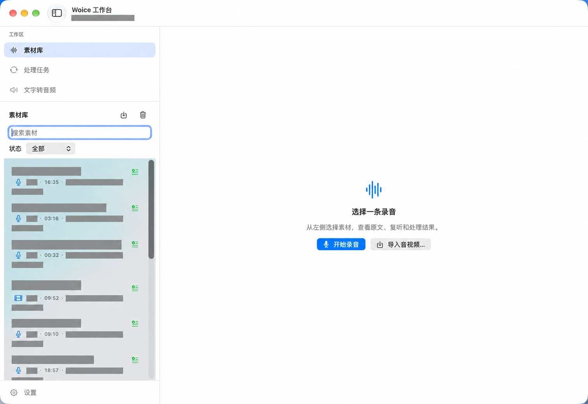
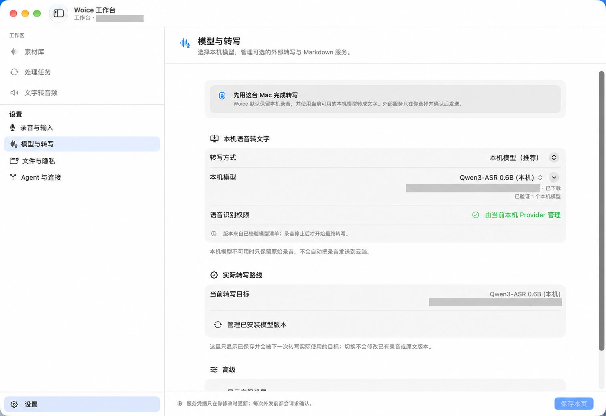
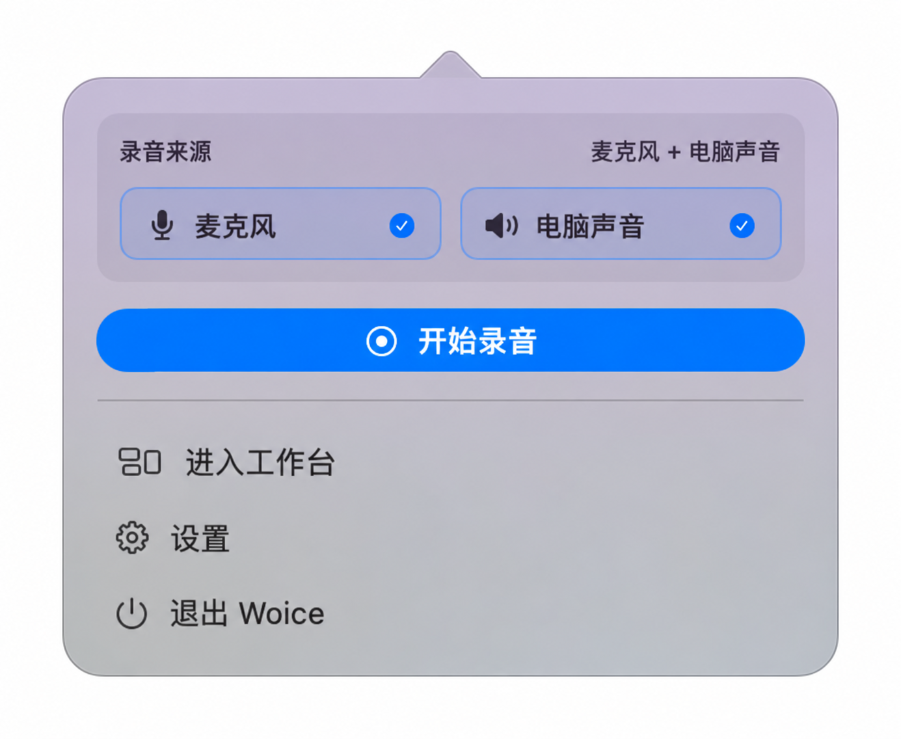

# 我做了一个免费的 Mac 录音工具：让声音留在自己的电脑里

开会、听课、聊需求，或者突然想到一个点子，我们都可能按下录音键。

可录下来以后呢？

文件越来越多，想找一句话，要翻半天。想转成文字，要上传、等处理，看看还剩多少额度。碰到客户沟通、内部讨论，又会犹豫：这段内容适不适合交给外部平台？

我想把这些事情放到同一个工具里：**在 Mac 上录音，在 Mac 上转成文字，之后还能搜索、复听，把素材带走。**

于是，我做了 **Woice**。

它是一款本地优先的 Mac 语音素材工具。现在已经开源，App Store 也可以免费下载。[下载 Woice](https://apps.apple.com/cn/app/woice/id6805397359)

*素材库界面。本文配图由实际截图经 AI 脱敏处理，涉及客户、会议和个人内容的区域已遮盖，局部显示可能与原截图略有差异。*

## 成本：录得越多，我不想越惦记剩余额度

录音工具的成本，不能只看下载时付了多少钱。

还要看转写是否收费，有没有分钟上限，导出是否需要升级，以及长期使用要付多少。

比如 Otter 的免费方案提供每月 300 分钟转写；Pro 常规月付价格为每人 16.99 美元，年付折算每月 8.33 美元，提供每月 1,200 分钟的应用内录音转写额度。它把会议协作、摘要和工作流打包在一起，适合需要这些能力的人。[Otter 官方套餐](https://otter.ai/pricing)

举个假设：如果你每周录 10 小时，按四周算，一个月就是 2,400 分钟。选工具时，除了识别效果，你也得考虑套餐够不够用。

Woice 走的是本机处理这条路。

**截至 2026 年 10 月 1 日，Woice 中国区 App Store 下载价格为免费。选择本机模型转写，不需要购买云端转写分钟额度。**[Woice 商店页面](https://apps.apple.com/cn/app/woice/id6805397359)

这并不意味着没有成本：模型要下载，会占磁盘；转写会用到 Mac 的算力，长录音需要等待。如果你主动接入收费的外部转写服务，费用也由对应服务另算。

对已经有一台合适的 Mac、经常录音的人来说，这种方式的吸引力很直接：可以更多地考虑“这段话值不值得留下”，少考虑“今天还剩多少转写额度”。

当然，免费也不是 Woice 独有的优势。苹果自带的语音备忘录就能满足不少日常需求；MacWhisper 也有免费版本，官网直接购买的 Pro 目前为 64 欧元一次性授权，App Store 版则有不同的订阅安排。[MacWhisper 官网](https://www.macwhisper.com/) · [官方版本与收费说明](https://docs.macwhisper.com/article/40-macwhisper-whisper-transcription-difference)

**要比的，是你需要的完整流程要花多少钱。**

## 私密性：工作内容，能留在本机就先留在本机

很多录音里，有比声音更重要的东西：客户要求、内部讨论、尚未公开的想法，以及不想随手上传的个人经历。

我希望用户能清楚地知道，素材在哪里，什么时候会离开电脑。

Woice 默认在本机保存录音和文字。无需注册 Woice 账号，下载并安装本机模型后，可以断网录音、转写、复听和搜索。[Woice 产品说明](https://apps.apple.com/cn/app/woice/id6805397359)

*可以选择本机模型；模型不可用时保留原始录音，不会自动改为上传云端。*

这里有一个我很在意的边界：**本机转写失败，不会成为自动外发的理由。**

只有你主动配置外部转写服务、选择素材并确认发送，对应内容才会交给该服务。模型首次下载需要联网，但下载模型和上传你的录音，是两件不同的事。[Woice 隐私说明](https://github.com/WaterDJiang/woice/blob/main/PRIVACY.md)

素材也可以保存在你选定的 Mac 文件夹中，在 Finder 里查看、备份和带走。重转写创建新的版本，保留原始录音和原始转录。[Woice 产品说明](https://apps.apple.com/cn/app/woice/id6805397359)

这不是“绝对安全”的承诺。电脑本身的安全、你选择的备份位置，以及后来把文字发给谁，仍然会影响私密性。

同样，也不能把云端工具简单说成“不安全”。它们有自己的安全机制和隐私政策，换来的是跨设备访问、共享与协作。比如 Otter 的政策明确说明会处理用户提供的录音和会议信息；是否适合你的工作内容，需要结合实际使用方式判断。[Otter 隐私政策](https://otter.ai/privacy-policy)

MacWhisper、Aiko 也提供本机转写。**本地处理已经是一条成熟的产品路线，Woice 是这条路线上的一个新选择。**[MacWhisper 官网](https://www.macwhisper.com/) · [Aiko 官网](https://sindresorhus.com/aiko)

## 便捷性：把“录下来”和“以后用得上”接起来

我希望录音动作足够轻。

Woice 的菜单栏面板里，可以选择麦克风、电脑声音，或者同时录两种来源，然后点击开始录音。

*菜单栏录音入口。截图周围的桌面内容已移除。*

自己口述想法，用麦克风。记录电脑正在播放的声音，选择电脑声音。线上会议里需要保留自己和对方的发言，就按需要打开两种来源。

电脑声音采集需要相应系统权限；Woice 只采集声音，不保存屏幕画面。[Woice 产品说明](https://apps.apple.com/cn/app/woice/id6805397359)

已有的音频、视频，也可以导入处理。录完后，素材进入同一个工作台：查看原文、复听录音、搜索内容，需要时复制或导出。[Woice 开源项目说明](https://github.com/WaterDJiang/woice)

你可以导出音频、TXT、带时间戳的 JSON 和 Markdown。写文章、整理课程、做项目记录时，可以把素材交给自己熟悉的工具继续用。[Woice 导出能力](https://apps.apple.com/cn/app/woice/id6805397359)

我最在意的便利，是减少中间的搬运：录音文件、转写结果和后续查找，都能在同一个地方衔接起来。

## 怎么选？各有适合的场景

| 工具 | 成本方式 | 值得选它的理由 | 需要权衡的地方 |
|---|---|---|---|
| 苹果语音备忘录 | 系统自带 | 随手录音，Apple 设备之间使用方便；符合条件的 Mac 也能转写、搜索文字 | Mac 转写要求 macOS 15+ 与 Apple 芯片，功能受地区限制；模型选择与专业素材导出并非其主要方向 |
| Otter | 免费额度＋付费订阅 | 自动会议记录、摘要、共享与团队协作 | 套餐额度、持续费用，以及录音交给服务方处理的边界 |
| MacWhisper | 免费版；官网 Pro 一次性付费，商店版另有订阅 | 本机转写，批量处理、字幕和会议等功能丰富 | 高级功能的授权成本；使用云端或 AI 集成时需另看数据去向与费用 |
| Woice | 当前商店免费下载；源码 MIT 开源 | 菜单栏采集、本机模型、素材库与开放导出，适合个人长期积累语音材料 | 需要准备模型并占用本机资源；产品仍年轻，团队协作与复杂后期流程不是当前重点 |

*对比依据：[苹果转写与搜索说明](https://support.apple.com/zh-cn/guide/voice-memos/vm4a03609f0d/mac)、[苹果录音与跨设备说明](https://support.apple.com/zh-cn/guide/voice-memos/vmaa4b813415/mac)、[Otter 功能与套餐](https://otter.ai/pricing)、[MacWhisper 功能](https://www.macwhisper.com/)、[Woice 商店说明](https://apps.apple.com/cn/app/woice/id6805397359)。价格核对日期为 2026 年 10 月 1 日，地区、渠道和活动价格可能不同。*

如果只是偶尔录一段备忘，先试系统自带工具就够了。

如果需要团队一起看纪要、自动共享和管理会议，可以优先看成熟的会议协作产品。

如果要做大量字幕、批量转写和专业文件处理，MacWhisper 很值得比较。

**如果你主要在 Mac 上工作，经常录会议、口述想法、整理音视频，又希望素材默认留在本机，Woice 可以试试。**

## Woice 的不足，也先讲清楚

作为开发者，我当然希望你来用，但也不想让你带着错误的预期下载。

- **目前聚焦 Mac。** 本机模型使用主要面向 Apple 芯片 Mac，系统需 macOS 14 或更高版本；Windows、Android 和手机端不是当前支持范围。
- **第一次需要准备。** 选择素材位置、授予录音权限、下载模型，都需要完成。离线转写的前提，是模型已经安装好。
- **识别结果仍要复核。** 专有名词、口音、背景噪声和多人重叠说话，都可能影响文字。本文没有证明 Woice 比竞品识别更准，重要内容仍需对照原音。
- **本机资源有限。** 大模型与长录音会带来存储、内存和处理时间的开销。
- **仍在持续迭代。** 自动区分每个说话人、成熟的团队协作、复杂编辑与自动纪要，都不是这篇文章对当前版本的承诺。

Woice 想先把录音、转写、复听、搜索和导出这条日常流程做好，让你留下的声音以后还能用得上。

## 两种入口，按你的习惯选择

**直接安装：**[Mac App Store 下载 Woice](https://apps.apple.com/cn/app/woice/id6805397359)

当前免费下载，适合想直接使用的人。具体兼容条件和最新版本以商店页面为准。

**看源码、自己构建或参与改进：**[GitHub：WaterDJiang/woice](https://github.com/WaterDJiang/woice)

Woice 源码采用 [MIT License](https://github.com/WaterDJiang/woice/blob/main/LICENSE)。第三方依赖与模型权重分别遵守各自许可。

如果你愿意试，可以从下一次口述灵感开始：录一小段，转成文字，再搜回来。看看这套流程，是否适合你。
