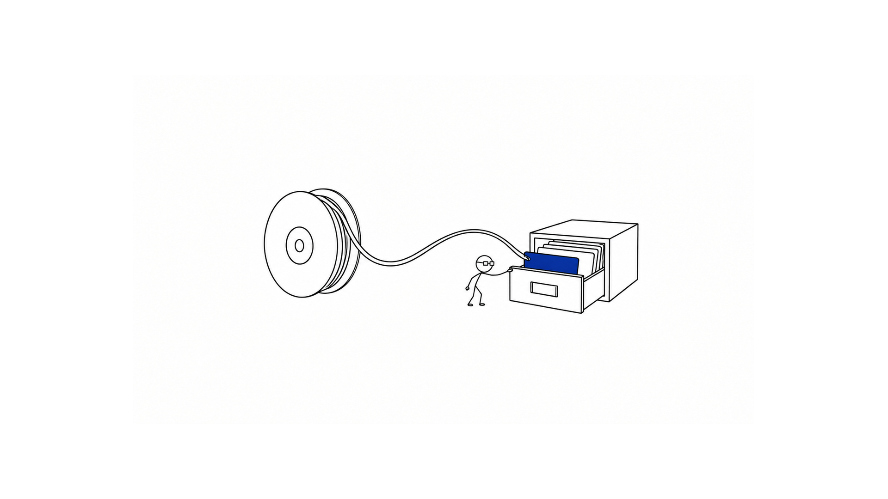
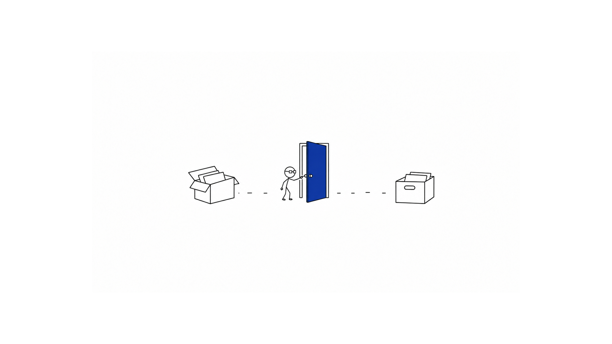

# 一段 AI 录音的成本，不只是转写费

选录音工具，月费和转写额度很好比较。但如果你要把一段工作沟通留到下次写材料时用，还得考虑两件事：内容会交给谁，录完之后能不能方便地找回来。

这几件事放在一起，才构成你长期使用一个录音工具的成本。钱要花多少，操作要做几步，哪些内容愿意上传，都需要按自己的工作方式判断。

Woice 是我做的 Mac 语音素材工具。起心动念很直接：看到一些录音转文字工具开始按额度或订阅收费，而我又经常需要在本机完成录音、转写和资料管理，就想给自己做一个能长期使用的工具。这里拿它和现有工具一起看，聊聊这几项取舍。

## 转写费用之外，还有准备和等待

截至 2026 年 10 月 1 日，Otter 的免费方案提供每月 300 分钟转写；Pro 常规月付价格为每人 16.99 美元，年付折算每月 8.33 美元，套餐卡片列出的应用内录音转写额度为每月 1,200 分钟。导入次数、单次会议时长也有各自的限制。

如果你经常录长会，就得一起看这些限制。月费看起来能接受，实际使用时也可能先碰到单次时长或文件导入次数的上限。

国内的飞书妙记，也需要区分转写和纪要两项权益。基础版每人每月有 300 分钟语音转文字额度；飞书 AI 会员 69 元/月，包含每月 3,000 分钟转写和 1,000 点 AI 额度，Plus 入门档为 138 元/月、6,000 分钟转写。

转写分钟和 AI 纪要额度是两笔账。按当前规则，智能纪要通常每分钟消耗 0.5 点 AI 额度，点数还与其他功能共用。一次 60 分钟的纪要按这个标准消耗 30 点，不能把「3,000 分钟转写」直接理解成「3,000 分钟 AI 纪要」。公司已有套餐的用户，也先查已有转写权益。

千问的录音纪要目前还有免费额度可用，可以先试。只是，今天免费不代表以后一直免费：后续可能调整额度，也可能开始收费。长期使用时，要给这项变化留出余地，具体额度和收费安排以当前账号内显示为准。

付费也有它解决的问题。会议自动记录、共享、团队协作，都可能减少你的后续工作。如果你确实需要这些能力，订阅费用就有对应的价值。

本机转写提供了另一种选择：模型在自己的电脑上运行，处理这些录音不用购买云端转写分钟。

Woice 目前在中国区 App Store 免费下载，可以使用本机模型转写。费用不会随本机转写分钟累加，但你需要一台合适的 Mac，也要下载模型、留出存储空间，等待电脑处理录音。

如果电脑性能有限，或者你不想管理本机模型，这些准备和等待也会成为负担。免费只能说明下载价格，不能单独证明整套使用过程更省心。

MacWhisper 同样提供本机转写。它有免费版，官网直接购买的 Pro 目前为 64 欧元一次性授权；App Store 版有不同的订阅安排。需要批量处理、字幕等能力的人，也可以把它放进比较。

## 买了录音硬件，还要看转写的后续费用

另一类选择是 Get 笔记配套的 GetSeed、PLAUD Note 这样的 AI 录音卡。它们把录音入口做成实体开关或按键，适合离开电脑之后的采访、现场会议和随手口述。购机解决的是采集问题，转成文字、生成纪要，还要看配套服务的权益。

Get 笔记目前的官方文档使用「得到大脑」名称。GetSeed 可以独立录音、之后再同步。官方说明也把到期后的行为写得很清楚：会员过期，硬件仍能正常录音；非会员每月有 600 分钟录音卡转写额度，会员的硬件转写不限时。用完免费额度，可以等下月重置，也可以续会员。

| 录音硬件方案 | 买设备之后，转写怎么计费 |
|---|---|
| GetSeed／得到大脑（原 Get 笔记） | 硬件另行购买，赠送会员时长随套装确认；非会员每月 600 分钟录音卡转写。官方会员文档列正价 399 元/年，会员的硬件转写不限时 |
| PLAUD Note（国际官网口径） | 设备 159 美元，含每月 300 分钟免费转写；Pro 年付 99.99 美元，每月 1,200 分钟；Unlimited 年付 239.99 美元，转写不限时 |

*核对日期：2026 年 10 月 2 日。GetSeed 当前购机价以官方商城具体套装为准；PLAUD 此处为国际官网美元价，不套用为中国区价格。*

买之前可以算一次自己的用量。例如，每月录 20 小时就是 1,200 分钟，已经超过 GetSeed 非会员的 600 分钟和 PLAUD 入门方案的 300 分钟。此时再比较转写会员、赠送期结束后的续费，以及是否需要额外设备，才是完整的费用比较。

不过，硬件的价值也很具体。出门采访时拨一下就能录，不需要打开 Mac；如果你大量录的是现场对话，这种便利值得付费。反过来，如果你主要坐在 Mac 前开线上会议或整理音视频，先用现有电脑完成采集和转写，就少了一项购机、充电与同步的负担。

所以，选工具时先看自己的录音量，再看采集场景与后续收费。偶尔录几条备忘、每周处理长会和经常外出采访，适合的方案可能不同。

## 便捷，要从录下来一直看到下次使用

假设你录了一次需求沟通，下周要根据它写方案。录音完成之后，你还需要找到当时讨论的那段话，确认原意，再把文字放进自己的文档。

这才是一次完整的使用过程。

如果音频在一个软件里，转写在另一个网页里，最后的文字又散在不同文件夹，查回内容时就需要来回搬运。实际有多少步骤，得用你平时的素材走一遍才能知道。

Woice 把采集入口放在 Mac 菜单栏里，可以选择麦克风、电脑声音，或者同时录两种来源。自己口述用麦克风；线上沟通需要保留双方的声音时，再按需要打开电脑声音，并授予相应系统权限。

*菜单栏入口。本文三张界面截图均由实际截图经 AI 脱敏处理，局部显示可能与原截图略有差异。*

录完后，音频和转写结果进入素材库，可以搜索、复听、复制和导出。已有的音频、视频，也可以导入处理。

*素材库界面。客户、会议和个人内容已遮盖。*

这里的作用是把前后衔接起来。查到一段文字，需要核对时能回到原音；要交给其他工具，可以导出音频、TXT、带时间戳的 JSON 或 Markdown。重转写会生成新版本，保留原始音频和原始转录。

如果团队已经在飞书里开会，妙记可以承接会议录制，也能上传其他来源的音视频，生成可查的文字记录，再结合智能纪要整理重点和待办。对这样的团队来说，少一次搬运、让协作者在同一处查看，就可能比省下一笔月费更有用。

千问官网则直接提供录音纪要／实时记录入口，面向语音转写和纪要生成。如果你需要的是录完后得到一份整理过的会议内容，可以先用同一段短录音比较它与其他工具的结果，核对原话和总结是否吻合。

便捷需要按任务来比。个人查资料，重视录音和原文能不能一起找到；团队开会，可能更重视共享和分工。同一个功能列表，不能替这两种人做同一个选择。

## 内容会去哪里，需要单独决定

有些录音适合上传，有些录音你希望先留在自己的电脑上。这项取舍也没必要折算成金额。

客户沟通、内部讨论、还没公开的想法，都可能包含你需要谨慎处理的内容。使用云端服务前，要知道它会接收什么、怎样保存，以及你是否愿意按这些条件使用。比如 Otter 的隐私政策说明了对用户提供的录音和会议信息的处理。

录音硬件也不等于本机转写。GetSeed 官方常见问题明确说明，转写要将音频上传云端处理，且不支持通过 USB 直接连接电脑管理文件。它可以离线采集声音，但后续转写仍要联网；购买时也需要把这条处理路线算进取舍。

飞书手机录音结束后也会上传。采用配套转写与纪要服务时，需要按具体入口确认内容的处理范围、分享权限和保存方式。

本机处理的好处，是录音转文字这一步可以在自己的设备上完成。Woice 不要求注册账号；本机模型安装好后，断网也能录音、转写、复听和搜索。

*本机转写设置。模型标识已遮盖，保留数据去向说明。*

Woice 本机转写失败时，会保留录音，不会自动把它发到云端。只有你主动配置外部转写服务、选择素材并确认发送，相应内容才会交给该服务。首次下载模型需要联网，下载模型和上传你的工作录音有不同的数据去向。

素材保存在你选定的 Mac 文件夹里，可以用 Finder 查看和备份。不过，留在本机之后，电脑安全、备份和后续分享仍需要自己管理。你把导出的文字交给其他服务时，也要重新考虑那一次发送。

## 按你实际要做的事选

把这几项放在一起，选择会更具体：

| 你的使用方式 | 可以先比较的工具 | 需要权衡的地方 |
|---|---|---|
| 团队会议，需要逐字稿、自动纪要、共享和协作 | 飞书妙记／智能纪要、Otter | 已有企业权益；转写与纪要额度是否分开；内容处理与分享权限 |
| 想先用免费额度试试 AI 录音纪要 | 千问录音纪要／实时记录 | 当前可用额度；后续是否调整收费；摘要是否保留原意 |
| 经常外出采访、现场开会，不方便打开电脑 | GetSeed、PLAUD Note 等录音硬件 | 购机费、赠送期与续费；转写额度；同步和云端处理是否适合自己 |
| 大量文件转写、批量处理或制作字幕 | MacWhisper | 所需功能的授权方式；本机资源与可选外部服务费用 |
| 个人在 Mac 上长期积累会议、口述和音视频素材 | Woice，也可以比较其他本机工具 | 模型准备、电脑性能、素材管理方式是否适合自己 |

*价格与权益依据官方资料整理。飞书与录音硬件资料核对日期为 2026 年 10 月 2 日；Otter、MacWhisper 与 Woice 商店价格核对于 10 月 1 日。地区、渠道、活动和账号权益可能不同。*

Woice 目前聚焦 Mac，本机模型主要面向 Apple 芯片设备，系统需 macOS 14 或更高版本。第一次使用要选择素材位置、授予权限、安装模型；长录音会占用本机资源，也需要处理时间。

它还在持续迭代。复杂的团队协作、自动区分每个说话人和完整的自动纪要流程，需要另行评估其他产品，不能只凭这篇文章中的录音与转写能力来判断。

识别质量也要用自己的场景验证。专有名词、噪声、口音和重叠说话，都可能影响结果；这篇没有提供同一音频下的准确率对比，不能据此得出 Woice 比竞品更准的结论。

你可以拿一段自己有权处理的短录音，完整做一次录制或导入、转写、搜索、复听和导出。看它在哪一步帮你省事，又在哪一步增加了负担，再决定是否长期使用。

## 相关入口

- [Woice · Mac App Store](https://apps.apple.com/cn/app/woice/id6805397359)：当前免费下载，兼容条件和最新版本以商店页面为准。
- [Woice · GitHub 开源仓库](https://github.com/WaterDJiang/woice)：源码采用 MIT License，第三方依赖与模型权重遵守各自许可。

*价格参考：[Otter](https://otter.ai/pricing) · [飞书 AI 会员](https://www.feishu.cn/service/ai?tab=personal) · [MacWhisper](https://www.macwhisper.com/) · [得到大脑会员](https://doc.biji.com/docs/AyPewORJhirCEzkuiBWcvCBfn0c) · [PLAUD 套餐](https://www.plaud.ai/pages/plaud-ai-plan-pricing)。*

